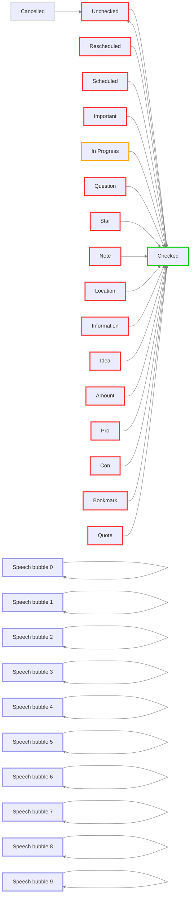

```mermaid
flowchart LR

classDef TODO        stroke:#f33,stroke-width:3px;
classDef DONE        stroke:#0c0,stroke-width:3px;
classDef IN_PROGRESS stroke:#fa0,stroke-width:3px;
classDef CANCELLED   stroke:#ddd,stroke-width:3px;
classDef NON_TASK    stroke:#99e,stroke-width:3px;

1["Unchecked"]:::TODO
2["Checked"]:::DONE
3["Rescheduled"]:::TODO
4["Scheduled"]:::TODO
5["Important"]:::TODO
6["Cancelled"]:::CANCELLED
7["In Progress"]:::IN_PROGRESS
8["Question"]:::TODO
9["Star"]:::TODO
10["Note"]:::TODO
11["Location"]:::TODO
12["Information"]:::TODO
13["Idea"]:::TODO
14["Amount"]:::TODO
15["Pro"]:::TODO
16["Con"]:::TODO
17["Bookmark"]:::TODO
18["Quote"]:::TODO
19["Speech bubble 0"]:::NON_TASK
20["Speech bubble 1"]:::NON_TASK
21["Speech bubble 2"]:::NON_TASK
22["Speech bubble 3"]:::NON_TASK
23["Speech bubble 4"]:::NON_TASK
24["Speech bubble 5"]:::NON_TASK
25["Speech bubble 6"]:::NON_TASK
26["Speech bubble 7"]:::NON_TASK
27["Speech bubble 8"]:::NON_TASK
28["Speech bubble 9"]:::NON_TASK
1 --> 2
2 --> 1
3 --> 2
4 --> 2
5 --> 2
6 --> 1
7 --> 2
8 --> 2
9 --> 2
10 --> 2
11 --> 2
12 --> 2
13 --> 2
14 --> 2
15 --> 2
16 --> 2
17 --> 2
18 --> 2
19 --> 19
20 --> 20
21 --> 21
22 --> 22
23 --> 23
24 --> 24
25 --> 25
26 --> 26
27 --> 27
28 --> 28

linkStyle default stroke:gray
```
