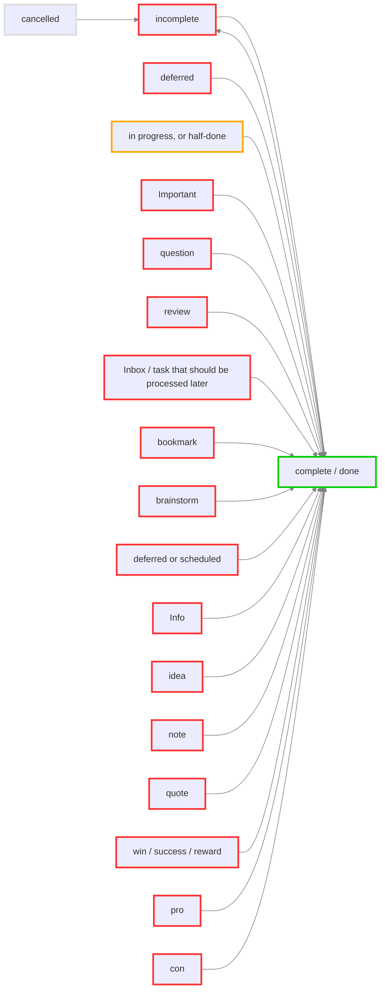

```mermaid
flowchart LR

classDef TODO        stroke:#f33,stroke-width:3px;
classDef DONE        stroke:#0c0,stroke-width:3px;
classDef IN_PROGRESS stroke:#fa0,stroke-width:3px;
classDef CANCELLED   stroke:#ddd,stroke-width:3px;
classDef NON_TASK    stroke:#99e,stroke-width:3px;

1["incomplete"]:::TODO
2["complete / done"]:::DONE
3["cancelled"]:::CANCELLED
4["deferred"]:::TODO
5["in progress, or half-done"]:::IN_PROGRESS
6["Important"]:::TODO
7["question"]:::TODO
8["review"]:::TODO
9["Inbox / task that should be processed later"]:::TODO
10["bookmark"]:::TODO
11["brainstorm"]:::TODO
12["deferred or scheduled"]:::TODO
13["Info"]:::TODO
14["idea"]:::TODO
15["note"]:::TODO
16["quote"]:::TODO
17["win / success / reward"]:::TODO
18["pro"]:::TODO
19["con"]:::TODO
1 --> 2
2 --> 1
3 --> 1
4 --> 2
5 --> 2
6 --> 2
7 --> 2
8 --> 2
9 --> 2
10 --> 2
11 --> 2
12 --> 2
13 --> 2
14 --> 2
15 --> 2
16 --> 2
17 --> 2
18 --> 2
19 --> 2

linkStyle default stroke:gray
```
