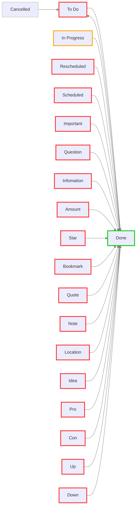

```mermaid
flowchart LR

classDef TODO        stroke:#f33,stroke-width:3px;
classDef DONE        stroke:#0c0,stroke-width:3px;
classDef IN_PROGRESS stroke:#fa0,stroke-width:3px;
classDef CANCELLED   stroke:#ddd,stroke-width:3px;
classDef NON_TASK    stroke:#99e,stroke-width:3px;

1["To Do"]:::TODO
2["In Progress"]:::IN_PROGRESS
3["Done"]:::DONE
4["Cancelled"]:::CANCELLED
5["Rescheduled"]:::TODO
6["Scheduled"]:::TODO
7["Important"]:::TODO
8["Question"]:::TODO
9["Infomation"]:::TODO
10["Amount"]:::TODO
11["Star"]:::TODO
12["Bookmark"]:::TODO
13["Quote"]:::TODO
14["Note"]:::TODO
15["Location"]:::TODO
16["Idea"]:::TODO
17["Pro"]:::TODO
18["Con"]:::TODO
19["Up"]:::TODO
20["Down"]:::TODO
1 --> 3
2 --> 3
3 --> 1
4 --> 1
5 --> 3
6 --> 3
7 --> 3
8 --> 3
9 --> 3
10 --> 3
11 --> 3
12 --> 3
13 --> 3
14 --> 3
15 --> 3
16 --> 3
17 --> 3
18 --> 3
19 --> 3
20 --> 3

linkStyle default stroke:gray
```
