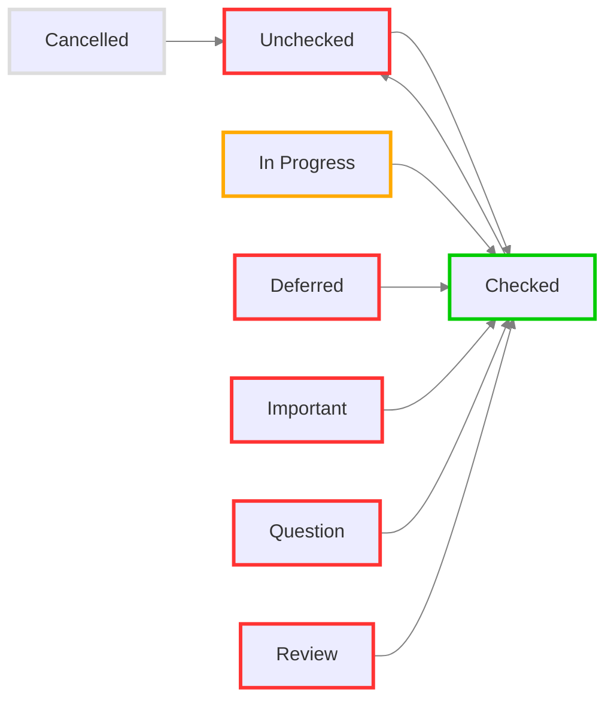

```mermaid
flowchart LR

classDef TODO        stroke:#f33,stroke-width:3px;
classDef DONE        stroke:#0c0,stroke-width:3px;
classDef IN_PROGRESS stroke:#fa0,stroke-width:3px;
classDef CANCELLED   stroke:#ddd,stroke-width:3px;
classDef NON_TASK    stroke:#99e,stroke-width:3px;

1["Unchecked"]:::TODO
2["Checked"]:::DONE
3["Cancelled"]:::CANCELLED
4["In Progress"]:::IN_PROGRESS
5["Deferred"]:::TODO
6["Important"]:::TODO
7["Question"]:::TODO
8["Review"]:::TODO
1 --> 2
2 --> 1
3 --> 1
4 --> 2
5 --> 2
6 --> 2
7 --> 2
8 --> 2

linkStyle default stroke:gray
```
