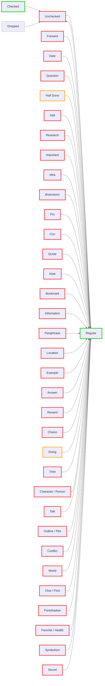

```mermaid
flowchart LR

classDef TODO        stroke:#f33,stroke-width:3px;
classDef DONE        stroke:#0c0,stroke-width:3px;
classDef IN_PROGRESS stroke:#fa0,stroke-width:3px;
classDef CANCELLED   stroke:#ddd,stroke-width:3px;
classDef NON_TASK    stroke:#99e,stroke-width:3px;

1["Unchecked"]:::TODO
2["Regular"]:::DONE
3["Checked"]:::DONE
4["Dropped"]:::CANCELLED
5["Forward"]:::TODO
6["Date"]:::TODO
7["Question"]:::TODO
8["Half Done"]:::IN_PROGRESS
9["Add"]:::TODO
10["Research"]:::TODO
11["Important"]:::TODO
12["Idea"]:::TODO
13["Brainstorm"]:::TODO
14["Pro"]:::TODO
15["Con"]:::TODO
16["Quote"]:::TODO
17["Note"]:::TODO
18["Bookmark"]:::TODO
19["Information"]:::TODO
20["Paraphrase"]:::TODO
21["Location"]:::TODO
22["Example"]:::TODO
23["Answer"]:::TODO
24["Reward"]:::TODO
25["Choice"]:::TODO
26["Doing"]:::IN_PROGRESS
27["Time"]:::TODO
28["Character / Person"]:::TODO
29["Talk"]:::TODO
30["Outline / Plot"]:::TODO
31["Conflict"]:::TODO
32["World"]:::TODO
33["Clue / Find"]:::TODO
34["Foreshadow"]:::TODO
35["Favorite / Health"]:::TODO
36["Symbolism"]:::TODO
37["Secret"]:::TODO
1 --> 2
2 --> 1
3 --> 1
4 --> 1
5 --> 2
6 --> 2
7 --> 2
8 --> 2
9 --> 2
10 --> 2
11 --> 2
12 --> 2
13 --> 2
14 --> 2
15 --> 2
16 --> 2
17 --> 2
18 --> 2
19 --> 2
20 --> 2
21 --> 2
22 --> 2
23 --> 2
24 --> 2
25 --> 2
26 --> 2
27 --> 2
28 --> 2
29 --> 2
30 --> 2
31 --> 2
32 --> 2
33 --> 2
34 --> 2
35 --> 2
36 --> 2
37 --> 2

linkStyle default stroke:gray
```
