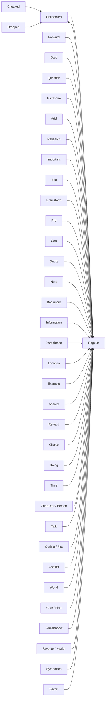

```mermaid
flowchart LR
1[Unchecked]
2[Regular]
3[Checked]
4[Dropped]
5[Forward]
6[Date]
7[Question]
8[Half Done]
9[Add]
10[Research]
11[Important]
12[Idea]
13[Brainstorm]
14[Pro]
15[Con]
16[Quote]
17[Note]
18[Bookmark]
19[Information]
20[Paraphrase]
21[Location]
22[Example]
23[Answer]
24[Reward]
25[Choice]
26[Doing]
27[Time]
28[Character / Person]
29[Talk]
30[Outline / Plot]
31[Conflict]
32[World]
33[Clue / Find]
34[Foreshadow]
35[Favorite / Health]
36[Symbolism]
37[Secret]
1 --> 2
2 --> 1
3 --> 1
4 --> 1
5 --> 2
6 --> 2
7 --> 2
8 --> 2
9 --> 2
10 --> 2
11 --> 2
12 --> 2
13 --> 2
14 --> 2
15 --> 2
16 --> 2
17 --> 2
18 --> 2
19 --> 2
20 --> 2
21 --> 2
22 --> 2
23 --> 2
24 --> 2
25 --> 2
26 --> 2
27 --> 2
28 --> 2
29 --> 2
30 --> 2
31 --> 2
32 --> 2
33 --> 2
34 --> 2
35 --> 2
36 --> 2
37 --> 2
```
