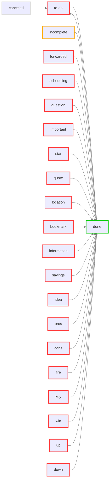

```mermaid
flowchart LR

classDef TODO        stroke:#f33,stroke-width:3px;
classDef DONE        stroke:#0c0,stroke-width:3px;
classDef IN_PROGRESS stroke:#fa0,stroke-width:3px;
classDef CANCELLED   stroke:#ddd,stroke-width:3px;
classDef NON_TASK    stroke:#99e,stroke-width:3px;

1["to-do"]:::TODO
2["incomplete"]:::IN_PROGRESS
3["done"]:::DONE
4["canceled"]:::CANCELLED
5["forwarded"]:::TODO
6["scheduling"]:::TODO
7["question"]:::TODO
8["important"]:::TODO
9["star"]:::TODO
10["quote"]:::TODO
11["location"]:::TODO
12["bookmark"]:::TODO
13["information"]:::TODO
14["savings"]:::TODO
15["idea"]:::TODO
16["pros"]:::TODO
17["cons"]:::TODO
18["fire"]:::TODO
19["key"]:::TODO
20["win"]:::TODO
21["up"]:::TODO
22["down"]:::TODO
1 --> 3
2 --> 3
3 --> 1
4 --> 1
5 --> 3
6 --> 3
7 --> 3
8 --> 3
9 --> 3
10 --> 3
11 --> 3
12 --> 3
13 --> 3
14 --> 3
15 --> 3
16 --> 3
17 --> 3
18 --> 3
19 --> 3
20 --> 3
21 --> 3
22 --> 3

linkStyle default stroke:gray
```
