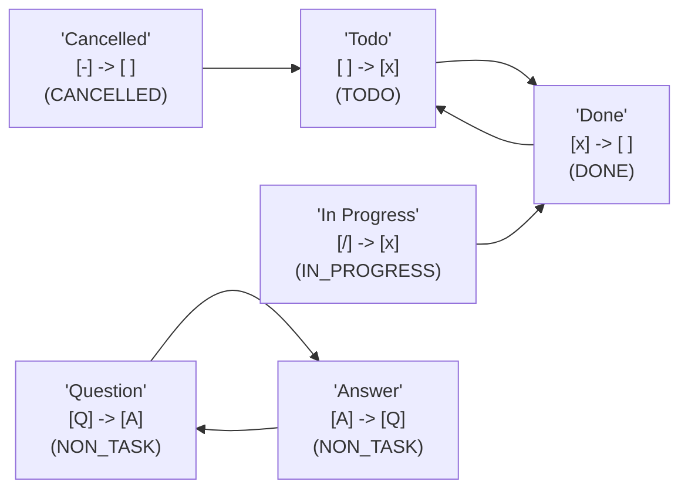

# Review and check your Statuses

This file was created by the Obsidian Tasks plugin, to help visualise the
task statuses in this vault.

You can delete this file any time.

<!-- Switch to Live Preview or Reading Mode to see the diagram. -->

